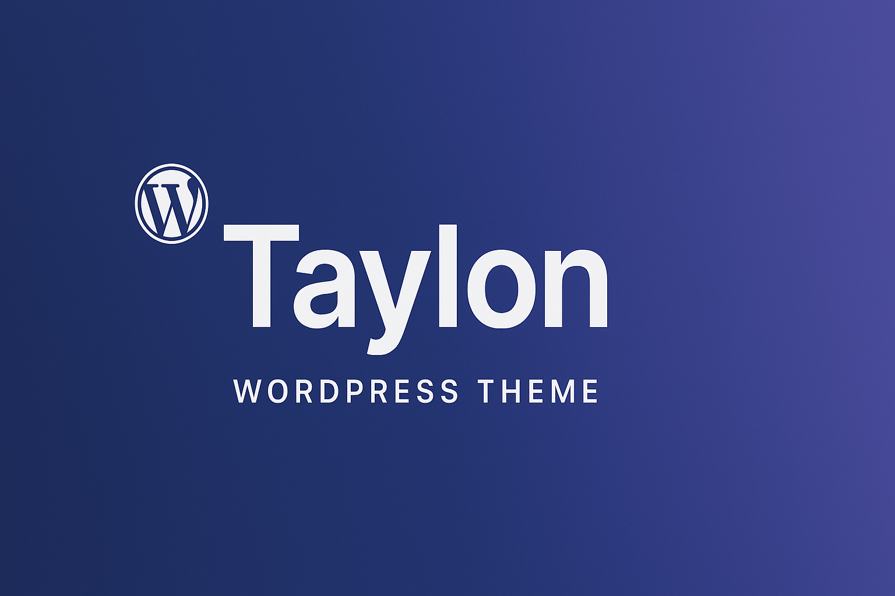

# 🌌 Neon Core - Futuristic WordPress Theme

[](https://www.gnu.org/licenses/gpl-3.0)


**Neon Core** is an ultra-modern WordPress theme with futuristic design, WebGL effects, and AI integration. Perfect for tech blogs, portfolios, and creative projects.



## ✨ Features

- **WebGL Background** - Dynamic 3D background using Three.js
- **AI Assistant** - Context-aware content suggestions
- **Voice Navigation** - Voice command support
- **Adaptive Dark Mode** - Automatic theme switching
- **Neon Design System** - Glowing UI elements and animations
- **Elementor Ready** - Full page builder compatibility
- **Multilingual Ready** - Built-in translation system

## 🚀 Installation

1. Download the theme ZIP file
2. Go to WordPress Admin → Appearance → Themes → Add New
3. Click "Upload Theme" and select the ZIP file
4. Activate the theme
5. Configure settings in Appearance → Customize

## ⚙️ Requirements

- WordPress 6.0+
- PHP 7.4+
- WebGL supported browser
- (Optional) Elementor plugin for advanced editing

## 🧩 Customization

Customize the theme through WordPress Customizer:
- **Neon Colors** - Change primary, secondary and accent colors
- **WebGL Effects** - Toggle 3D background
- **Header Settings** - Logo, navigation, voice control
- **AI Settings** - Configure content suggestions

## 💻 Development

```bash
# Recommended structure:
neon-core/
├── assets/
│   ├── css/
│   ├── js/
│   └── images/
├── inc/
│   ├── customizer.php
│   └── ai-integration.php
├── languages/
├── template-parts/
├── 404.php
├── footer.php
├── functions.php
├── header.php
├── index.php
├── README.md
├── screenshot.jpg
└── style.css
```

To contribute:

1. Fork the repository  
2. Create feature branch (`git checkout -b feature/amazing-feature`)  
3. Commit changes (`git commit -m 'Add amazing feature'`)  
4. Push to branch (`git push origin feature/amazing-feature`)  
5. Open a pull request

---

# 🌌 Neon Core - Футуристичная Тема WordPress

**Neon Core** — ультрасовременная тема WordPress с футуристичным дизайном, WebGL-эффектами и интеграцией ИИ. Идеально подходит для технологичных блогов, портфолио и креативных проектов.

## ✨ Особенности

- **WebGL фон** — Динамический 3D фон на Three.js
- **ИИ-ассистент** — Контекстные рекомендации контента
- **Голосовое управление** — Поддержка голосовых команд
- **Адаптивная темная тема** — Автоматическое переключение
- **Неоновая дизайн-система** — Светящиеся элементы и анимации
- **Совместимость с Elementor** — Поддержка конструктора страниц
- **Многоязычная поддержка** — Встроенная система перевода

## 🚀 Установка

1. Скачайте ZIP-файл темы  
2. Перейдите в админку WordPress → Внешний вид → Темы → Добавить новую  
3. Нажмите "Загрузить тему" и выберите ZIP-файл  
4. Активируйте тему  
5. Настройте параметры в разделе Внешний вид → Настроить  

## ⚙️ Требования

- WordPress 6.0+  
- PHP 7.4+  
- Браузер с поддержкой WebGL  
- (Опционально) Плагин Elementor для расширенного редактирования  

## 🧩 Настройка

Настройте тему через кастомайзер WordPress:  
- **Неоновые цвета** — Измените основные цвета темы  
- **WebGL эффекты** — Включите/выключите 3D фон  
- **Настройки шапки** — Логотип, навигация, голосовое управление  
- **Настройки ИИ** — Конфигурация рекомендаций контента  

## 💻 Разработка

```bash
# Рекомендуемая структура:
neon-core/
├── assets/
│   ├── css/
│   ├── js/
│   └── images/
├── inc/
│   ├── customizer.php
│   └── ai-integration.php
├── languages/
├── template-parts/
├── 404.php
├── footer.php
├── functions.php
├── header.php
├── index.php
├── README.md
├── screenshot.jpg
└── style.css
```

Для внесения изменений:

1. Форкните репозиторий  
2. Создайте ветку (`git checkout -b feature/ваша-фича`)  
3. Зафиксируйте изменения (`git commit -m 'Добавлена новая функция'`)  
4. Запушьте ветку (`git push origin feature/ваша-фича`)  
5. Создайте pull request

---

📜 **Лицензия**  
Neon Core распространяется под лицензией GPL v3. Детали в файле LICENSE.
